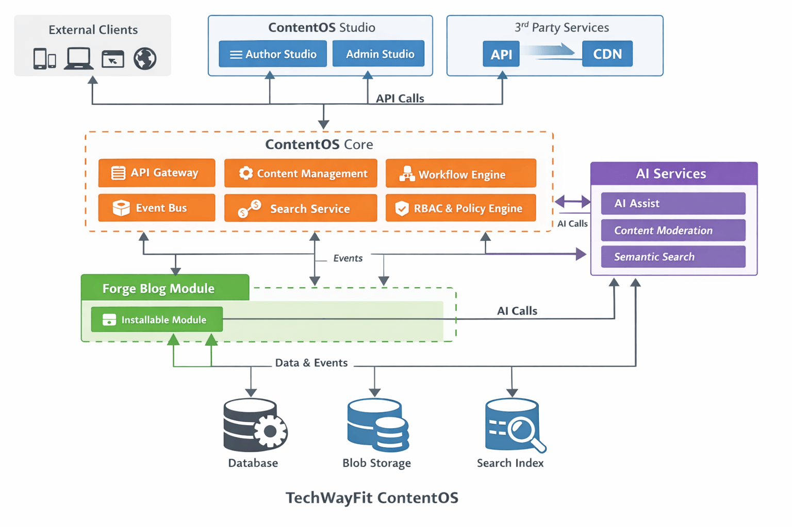
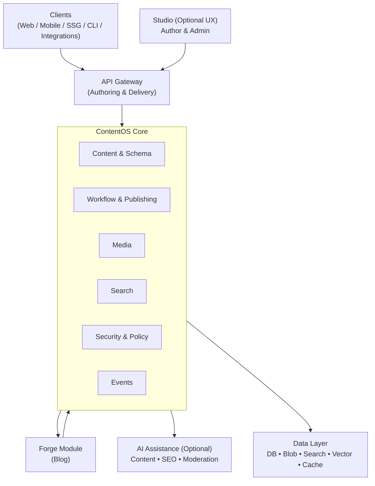

# TechWayFit ContentOS - Architecture Overview

## System Purpose

TechWayFit ContentOS is an enterprise-grade content management system designed for scalability, modularity, and multi-tenant deployments.

## Core Principles

- **Modularity**: System components are independently deployable and maintainable
- **API-First**: All functionality accessible via well-defined APIs
- **Multi-Tenancy**: Support for isolated customer environments with shared infrastructure
- **Extensibility**: Plugin and extension points for customization
- **Security**: Defense-in-depth approach with authentication, authorization, and data protection

### Solution Architecture

## High-Level Components

### Content Management Core
- Content storage and versioning
- Workflow and approval processes
- Digital asset management
- Search and indexing

### API Layer
- REST API for content operations
- GraphQL interface for flexible queries
- Webhook support for event-driven integrations
- Rate limiting and API security

### Authentication & Authorization
- Identity provider integration (SAML, OAuth2, OIDC)
- Role-based access control (RBAC)
- Multi-factor authentication support
- Audit logging

### Data Layer
- Primary data store for content
- Cache layer for performance
- Search index for full-text queries
- Backup and disaster recovery

### Frontend Applications
- Admin dashboard
- Content editor interface
- Preview and publishing tools

### Request Flow

## Technology Stack

To be defined based on specific implementation decisions documented in ADRs.

## Deployment Model

- Cloud-native architecture
- Container-based deployments
- Horizontal scaling capability
- Multi-region support for global deployments

## Integration Points

- Third-party authentication providers
- External storage systems (S3, Azure Blob, etc.)
- CDN for content delivery
- Analytics and monitoring platforms
- CRM and marketing automation tools

## Security Architecture

Detailed security architecture and threat models are documented in the `/security` folder.

## Related Documentation

- Architecture Decision Records: `/adr`
- API Documentation: `/api`
- Security Documentation: `/security`
- Product Roadmap: `/roadmap`
